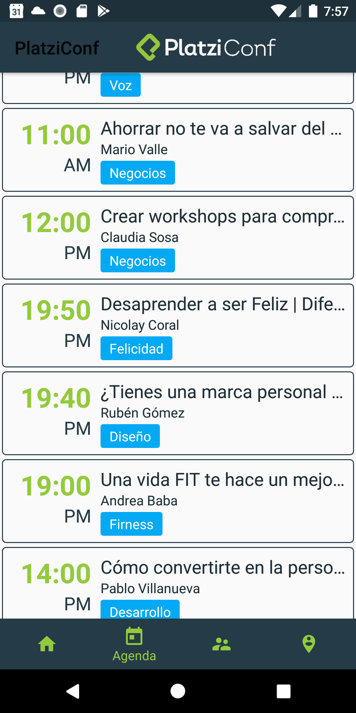

# PlatziConf 

 
**PlatziConf** es una aplicación creada con lenguaje de programación Kotlin, dicha apliación tiene como funcionalidad presentar toda la información acerca de la conferencia de Platzi la escuala online más grande a habla hispana la cual se lleva cabo cada año, presenta información de los Speakers, Horarios y ubicación del lugar donde se llevará a cabo.

# Capturas de Pantalla

  

  

## Librerias usadas:

* **Arquitectura** - Colección de bibliotecas que lo ayudan a diseñar aplicaciones robustas, comprobables y mantenibles. Comience con clases para administrar el ciclo de vida de su componente UI y manejar la persistencia de datos.
	* **LifeCycles** - Cree una interfaz de usuario que responda automáticamente a los eventos del ciclo de vida.
	* **LiveData** - Cree objetos de datos que notifiquen las vistas cuando cambie la base de datos subyacente.
	* **Navigation** - Maneja todo lo necesario para la navegación en la aplicación.
	* **ViewModel** - Almacenar datos relacionados con la interfaz de usuario que no se destruyen en las rotaciones de aplicaciones. Programe fácilmente tareas asincrónicas para una ejecución óptima.
	* **DataBinding** - Declarativamente enlazar datos observables a elementos de la interfaz de usuario.
* **UI** - Detalles de diseño
	* **Material Design** - Componentes de InputLayout para crear una mejor experiencia al usuario.
* **Mapas** - Ubicación mostrada en una Mapa.
	* **GoogleMapsApi** - Para mostrar la ubicación del lugar de la conferencia en el mapa de GoogleMaps.
* **DataBase** - Datos Almacenados.
	* **Firestore** - Los datos de la Conferencia se almacenan en Firestore para actualizar información de forma remota.
* **Tercero**
	* **Picasso** - para cargar las imágenes.
	* **CirlceImageView** - para colocar las imagenes de forma circular.

